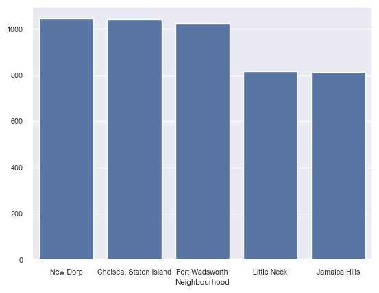

```python
import pandas as pd
import numpy as np
import matplotlib.pyplot as mpb
import os
import re
import seaborn as sea
```


```python
os.path.isfile(r'C:\Users\48730\Downloads\AirBnb_data\Airbnb_Open_Data.csv')
```

    C:\Users\48730\anaconda3\Lib\site-packages\IPython\core\displayhook.py:281: UserWarning: Output cache limit (currently 1000 entries) hit.
    Flushing oldest 200 entries.
      warn('Output cache limit (currently {sz} entries) hit.\n'
    


    True


```python
original = pd.read_csv(r'C:\Users\48730\Downloads\AirBnb_data\Airbnb_Open_Data.csv')
```

    C:\Users\48730\AppData\Local\Temp\ipykernel_31144\2365179328.py:1: DtypeWarning: Columns (25) have mixed types. Specify dtype option on import or set low_memory=False.
      original = pd.read_csv(r'C:\Users\48730\Downloads\AirBnb_data\Airbnb_Open_Data.csv')
    


```python
air = original.copy()
```


```python
#Inspection starts..........
```

    Inspection starts..........
    


```python
air.info()
```

    <class 'pandas.core.frame.DataFrame'>
    RangeIndex: 102599 entries, 0 to 102598
    Data columns (total 21 columns):
     #   Column                          Non-Null Count   Dtype         
    ---  ------                          --------------   -----         
     0   Id                              102599 non-null  int64         
     1   Name                            102349 non-null  object        
     2   Host_id                         102599 non-null  int64         
     3   Host_identity_verified          102599 non-null  object        
     4   Host_name                       102193 non-null  object        
     5   Neighbourhood_group             102570 non-null  object        
     6   Neighbourhood                   102583 non-null  object        
     7   Lattitude                       102591 non-null  float64       
     8   Longitude                       102591 non-null  float64       
     9   Instant_bookable                102494 non-null  object        
     10  Cancellation_policy             102523 non-null  object        
     11  Room_type                       102599 non-null  object        
     12  Construction_year               102385 non-null  datetime64[ns]
     13  Price                           102599 non-null  int32         
     14  Service_fee                     102326 non-null  object        
     15  Minimum_nights                  102599 non-null  int32         
     16  Number_of_reviews               102599 non-null  int32         
     17  Last_review                     86706 non-null   datetime64[ns]
     18  Review_rate_number              102599 non-null  int32         
     19  Calculated_host_listings_count  102599 non-null  int32         
     20  Availability_365                102151 non-null  float64       
    dtypes: datetime64[ns](2), float64(3), int32(5), int64(2), object(9)
    memory usage: 14.5+ MB
    


```python
air.shape
```


    (102599, 26)


```python
air.describe()
```


<div>
<style scoped>
    .dataframe tbody tr th:only-of-type {
        vertical-align: middle;
    }

    .dataframe tbody tr th {
        vertical-align: top;
    }

    .dataframe thead th {
        text-align: right;
    }
</style>
<table border="1" class="dataframe">
  <thead>
    <tr style="text-align: right;">
      <th></th>
      <th>id</th>
      <th>host id</th>
      <th>lat</th>
      <th>long</th>
      <th>Construction year</th>
      <th>minimum nights</th>
      <th>number of reviews</th>
      <th>reviews per month</th>
      <th>review rate number</th>
      <th>calculated host listings count</th>
      <th>availability 365</th>
    </tr>
  </thead>
  <tbody>
    <tr>
      <th>count</th>
      <td>1.025990e+05</td>
      <td>1.025990e+05</td>
      <td>102591.000000</td>
      <td>102591.000000</td>
      <td>102385.000000</td>
      <td>102190.000000</td>
      <td>102416.000000</td>
      <td>86720.000000</td>
      <td>102273.000000</td>
      <td>102280.000000</td>
      <td>102151.000000</td>
    </tr>
    <tr>
      <th>mean</th>
      <td>2.914623e+07</td>
      <td>4.925411e+10</td>
      <td>40.728094</td>
      <td>-73.949644</td>
      <td>2012.487464</td>
      <td>8.135845</td>
      <td>27.483743</td>
      <td>1.374022</td>
      <td>3.279106</td>
      <td>7.936605</td>
      <td>141.133254</td>
    </tr>
    <tr>
      <th>std</th>
      <td>1.625751e+07</td>
      <td>2.853900e+10</td>
      <td>0.055857</td>
      <td>0.049521</td>
      <td>5.765556</td>
      <td>30.553781</td>
      <td>49.508954</td>
      <td>1.746621</td>
      <td>1.284657</td>
      <td>32.218780</td>
      <td>135.435024</td>
    </tr>
    <tr>
      <th>min</th>
      <td>1.001254e+06</td>
      <td>1.236005e+08</td>
      <td>40.499790</td>
      <td>-74.249840</td>
      <td>2003.000000</td>
      <td>-1223.000000</td>
      <td>0.000000</td>
      <td>0.010000</td>
      <td>1.000000</td>
      <td>1.000000</td>
      <td>-10.000000</td>
    </tr>
    <tr>
      <th>25%</th>
      <td>1.508581e+07</td>
      <td>2.458333e+10</td>
      <td>40.688740</td>
      <td>-73.982580</td>
      <td>2007.000000</td>
      <td>2.000000</td>
      <td>1.000000</td>
      <td>0.220000</td>
      <td>2.000000</td>
      <td>1.000000</td>
      <td>3.000000</td>
    </tr>
    <tr>
      <th>50%</th>
      <td>2.913660e+07</td>
      <td>4.911774e+10</td>
      <td>40.722290</td>
      <td>-73.954440</td>
      <td>2012.000000</td>
      <td>3.000000</td>
      <td>7.000000</td>
      <td>0.740000</td>
      <td>3.000000</td>
      <td>1.000000</td>
      <td>96.000000</td>
    </tr>
    <tr>
      <th>75%</th>
      <td>4.320120e+07</td>
      <td>7.399650e+10</td>
      <td>40.762760</td>
      <td>-73.932350</td>
      <td>2017.000000</td>
      <td>5.000000</td>
      <td>30.000000</td>
      <td>2.000000</td>
      <td>4.000000</td>
      <td>2.000000</td>
      <td>269.000000</td>
    </tr>
    <tr>
      <th>max</th>
      <td>5.736742e+07</td>
      <td>9.876313e+10</td>
      <td>40.916970</td>
      <td>-73.705220</td>
      <td>2022.000000</td>
      <td>5645.000000</td>
      <td>1024.000000</td>
      <td>90.000000</td>
      <td>5.000000</td>
      <td>332.000000</td>
      <td>3677.000000</td>
    </tr>
  </tbody>
</table>
</div>


```python
air['license'].unique()
```


    array([nan, '41662/AL'], dtype=object)


```python
air['neighbourhood'].head(20)
```


    0             Kensington
    1                Midtown
    2                 Harlem
    3           Clinton Hill
    4            East Harlem
    5            Murray Hill
    6     Bedford-Stuyvesant
    7     Bedford-Stuyvesant
    8         Hell's Kitchen
    9        Upper West Side
    10             Chinatown
    11       Upper West Side
    12        Hell's Kitchen
    13           South Slope
    14       Upper West Side
    15          West Village
    16          Williamsburg
    17           Fort Greene
    18               Chelsea
    19         Crown Heights
    Name: neighbourhood, dtype: object


```python
air['host_identity_verified'].info()
```

    <class 'pandas.core.series.Series'>
    RangeIndex: 102599 entries, 0 to 102598
    Series name: host_identity_verified
    Non-Null Count   Dtype 
    --------------   ----- 
    102310 non-null  object
    dtypes: object(1)
    memory usage: 801.7+ KB
    


```python
air.iloc[10000]
```


    Id                                                           6524336
    Name                              Cozy one br in queens near airport
    Host_id                                                  56495168791
    Host_identity_verified                                      verified
    Host_name                                                     Falana
    Neighbourhood_group                                           Queens
    Neighbourhood                                                Jamaica
    Lattitude                                                   40.68547
    Longitude                                                  -73.78924
    Instant_bookable                                                True
    Cancellation_policy                                         moderate
    Room_type                                               Private room
    Construction_year                      1970-01-01 00:00:00.000002018
    Price                                                            443
    Service_fee                                                       89
    Minimum_nights                                                     3
    Number_of_reviews                                                  0
    Last_review                                                      NaT
    Review_rate_number                                                 1
    Calculated_host_listings_count                                     1
    Availability_365                                                 4.0
    Name: 10000, dtype: object


```python
air[air['Name'].str.contains(r'\d',na=False)].tail(20)
```


```python
#Cleaning started///////////////////
```

    Cleaning started///////////////////
    


```python
air.drop(columns=['house_rules','license'],inplace=True)
```


```python
air.drop(columns='country code',inplace=True)
```


```python
air.drop(columns='country',inplace=True)
```


```python
air.drop(columns='reviews per month',inplace=True)
```


```python
air.columns=air.columns.str.strip().str.capitalize().str.replace(r' ','_')
```


```python
air.rename(columns={'Lat':'Lattitude'},inplace=True)
air.rename(columns={'Long':'Longitude'},inplace=True)
```


```python
air['Construction_year']=pd.to_datetime(air['Construction_year'],errors='coerce')
air['Last_review']=pd.to_datetime(air['Last_review'],errors='coerce')
```


```python
#Cleaning values started////////
```


```python
air['Price']=air['Price'].replace(r'\,','',regex=True).fillna(0).astype(int)
```


```python
air['Service_fee']=air['Service_fee'].str.strip().fillna(0).astype(int)
```


```python
air['Calculated_host_listings_count']=air['Calculated_host_listings_count'].fillna(0).astype(int)
```


```python
cols=['Number_of_reviews','Minimum_nights']
air[cols]=air[cols].apply(lambda col: col.fillna(0).astype(int))
```


```python
air['Review_rate_number']=air['Review_rate_number'].fillna(0).astype(int)
```


```python
air['Service_fee']=air['Service_fee'].fillna(0)
air['Last_review']=air['Last_review'].fillna(0)
air['Lattitude']=air['Lattitude'].fillna(0)
air['Longitude']=air['Longitude'].fillna(0)
cols=['Host_name','Neighbourhood_group','Neighbourhood','Instant_bookable','Cancellation_policy']
for col in cols:
    air[col]=air[col].fillna('Unknown').str.strip()
```


```python
air['Cancellation_policy'].isna().value_counts()
```


    Cancellation_policy
    False    102599
    Name: count, dtype: int64


```python
#Cleaning all extra signs,imoji,spaces betw words "Name" and Servise_fee columns
```


```python
air['Name']=air['Name'].str.replace(r'\s{2,}',' ',regex=True).str.strip()
```


```python
air['Name']=air['Name'].replace(r'\s+([/,.!?\+\-\(\)])',r'\1',regex=True)
```


```python
air['Name']=air['Name'].replace(r'([/,.!?\+\-\(\)])\s+',r'\1',regex=True)
```


```python
air['Name']=air['Name'].replace(r'(\w)\.+',r'\1.',regex=True)
```


```python
emoji_pattern = re.compile(
"["
"\U0001F600-\U0001F64F"
"\U0001F300-\U0001F5FF"
"\U0001F680-\U0001F6FF"
"\U0001F1E0-\U0001F1FF"
"\u2600-\u26FF"
"\u2700-\u27BF"
    "]+", flags=re.UNICODE)

air['Name']=air['Name'].str.replace(emoji_p,'',regex=True).str.strip()
```


```python
air['Name']=air['Name'].replace(r'•+',r'',regex=True).str.strip()
```


```python
air['Name']=air['Name'].str.capitalize()
```


```python
air['Service_fee']=air['Service_fee'].str.replace(r'\$','',regex=True).str.strip()
air['Price']=air['Price'].str.replace(r'\$','',regex=True).str.strip()

```


```python
# filling Host_id_verif colmn with unkown using 3 cols.
```


```python
air['Host_identity_verified'] = air['Host_identity_verified'].fillna('unknown')
```


```python
air.info()
```

    <class 'pandas.core.frame.DataFrame'>
    RangeIndex: 102599 entries, 0 to 102598
    Data columns (total 21 columns):
     #   Column                          Non-Null Count   Dtype         
    ---  ------                          --------------   -----         
     0   Id                              102599 non-null  int64         
     1   Name                            102349 non-null  object        
     2   Host_id                         102599 non-null  int64         
     3   Host_identity_verified          102599 non-null  object        
     4   Host_name                       102599 non-null  object        
     5   Neighbourhood_group             102599 non-null  object        
     6   Neighbourhood                   102599 non-null  object        
     7   Lattitude                       102599 non-null  float64       
     8   Longitude                       102599 non-null  float64       
     9   Instant_bookable                105 non-null     object        
     10  Cancellation_policy             102599 non-null  object        
     11  Room_type                       102599 non-null  object        
     12  Construction_year               102385 non-null  datetime64[ns]
     13  Price                           102599 non-null  int32         
     14  Service_fee                     102599 non-null  object        
     15  Minimum_nights                  102599 non-null  int32         
     16  Number_of_reviews               102599 non-null  int32         
     17  Last_review                     102599 non-null  object        
     18  Review_rate_number              102599 non-null  int32         
     19  Calculated_host_listings_count  102599 non-null  int32         
     20  Availability_365                102151 non-null  float64       
    dtypes: datetime64[ns](1), float64(3), int32(5), int64(2), object(10)
    memory usage: 14.5+ MB
    


```python
top5 = air.groupby('Neighbourhood')['Price'].mean().sort_values(ascending=False).head(5)

sea.barplot(x=top5.index, y=top5.values)
sea.set_theme(font_scale=0.8)


```


    

    


```python
air.to_csv('Cleaned_airbnb',index=False)
```


```python
os.getcwd()
```


    'C:\\Users\\48730'


```python
folder='C:\\Users\\48730'
```


```python
folder
```


    'C:\\Users\\48730'


```python

```
